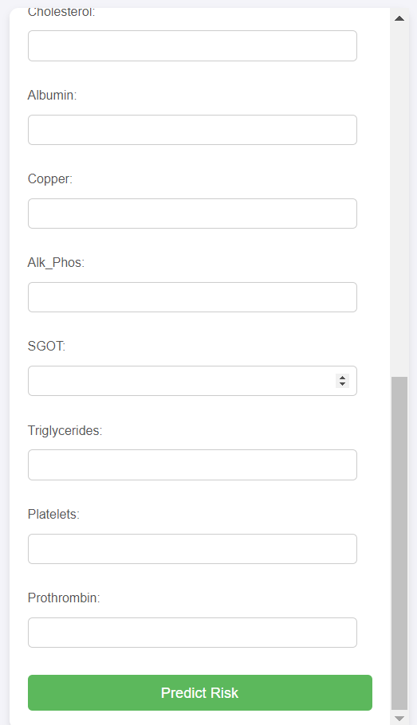

# Liver Cirrhosis Risk Prediction System

*An image of the interface where users input patient data.*

## Overview
This project is a **Liver Cirrhosis Risk Prediction System** that uses machine learning to predict the likelihood that a patient may have liver cirrhosis based on medical input features. The prediction is done using a trained **CatBoost Classifier**, which evaluates the risk of liver cirrhosis and categorizes it into **Low Risk**, **Medium Risk**, or **High Risk**.

The web-based interface allows users to input relevant patient information and get an immediate risk assessment without showing the probability values directly to simplify the interpretation of results.

## Features
- **Simple User Interface** for patient data input.
- **Real-time risk prediction** for liver cirrhosis.
- **Risk categories** (Low, Medium, High) based on predicted probability.
- Built using the **CatBoost** machine learning model for accurate predictions.
- **Flask** is used to create the backend for the web app.

  
*An image of the result page showing the risk category.*

## Libraries Used

The following libraries and frameworks were used in this project:

- **[CatBoost](https://catboost.ai/)**: A fast, scalable, high-performance machine learning library used for training the classifier and making predictions.
- **[Flask](https://flask.palletsprojects.com/)**: A lightweight WSGI web application framework to build the backend and handle routing.
- **[NumPy](https://numpy.org/)**: A powerful library for numerical computations and handling arrays.
- **[pandas](https://pandas.pydata.org/)**: A library for data manipulation and analysis.
- **[Matplotlib](https://matplotlib.org/)**: Used for optional visualization of risk categories and probabilities.
- **HTML & CSS**: For structuring and styling the front-end interface.
  
## Usage

1. **Input Patient Data**: Users must fill in the required fields in the form, including patient age, bilirubin levels, cholesterol levels, and other medical features.

2. **Risk Prediction**: After submitting the form, the system will predict the risk level of liver cirrhosis and display the result as either **Low Risk**, **Medium Risk**, or **High Risk**.

3. **New Prediction**: The user can easily reset the form and predict for another patient by clicking on the "Predict Another Patient" button.

## Input Features

The following patient attributes are required for the prediction:
- **Drug**: Binary value representing drug treatment.
- **Age**: The age of the patient.
- **Sex**: Binary value for sex (0 for male, 1 for female).
- **Ascites**: Binary value for the presence of ascites.
- **Hepatomegaly**: Binary value for hepatomegaly.
- **Spiders**: Binary value for spider angiomata.
- **Edema**: Binary value for the presence of edema.
- **Bilirubin**: Serum bilirubin level.
- **Cholesterol**: Cholesterol level.
- **Albumin**: Serum albumin level.
- **Copper**: Urine copper level.
- **Alk_Phos**: Alkaline phosphatase level.
- **SGOT**: Serum glutamic oxaloacetic transaminase (SGOT) level.
- **Triglycerides**: Triglyceride level.
- **Platelets**: Platelet count.
- **Prothrombin**: Prothrombin time.

## Risk Categories

The model assigns patients into one of three categories:
- **Low Risk**
- **Medium Risk**
- **High Risk**

The probability is computed by the CatBoost model but only the risk category is displayed to make the result more interpretable.

## Model Training

If you wish to retrain the model or understand how the model was trained:
1. **Data**: The dataset includes patient medical features and target labels indicating the presence of liver cirrhosis.
2. **Model**: The CatBoost classifier was trained using a cross-validation strategy and fine-tuned for optimal performance.
3. **Evaluation**: Model evaluation metrics include accuracy, precision, recall, and F1 score.

For details on how to train the model, refer to the `model_training.ipynb` file in the repository.

## Screenshots

### 1. Input Interface

### 2. Result Page

## Future Improvements

- Implement additional health parameters for more precise predictions.
- Add a feature to save patient prediction history.
- Further optimize the model for real-time clinical use.
  
## License

This project is licensed under the MIT License - see the [LICENSE](LICENSE) file for details.
